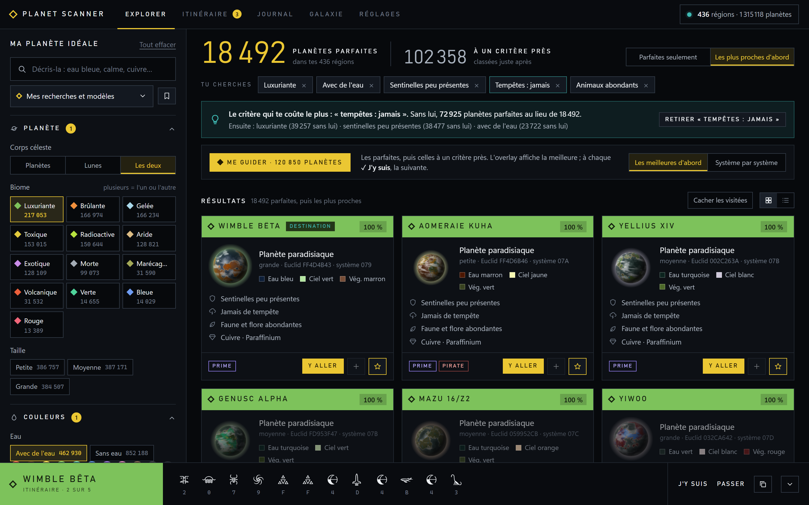
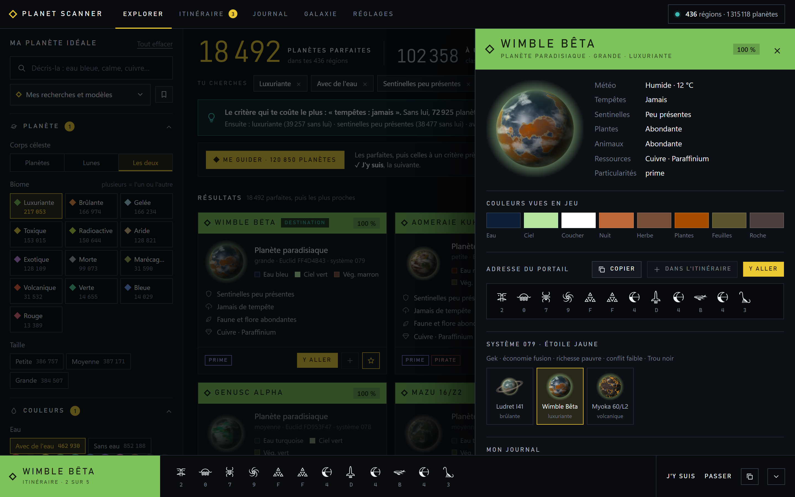
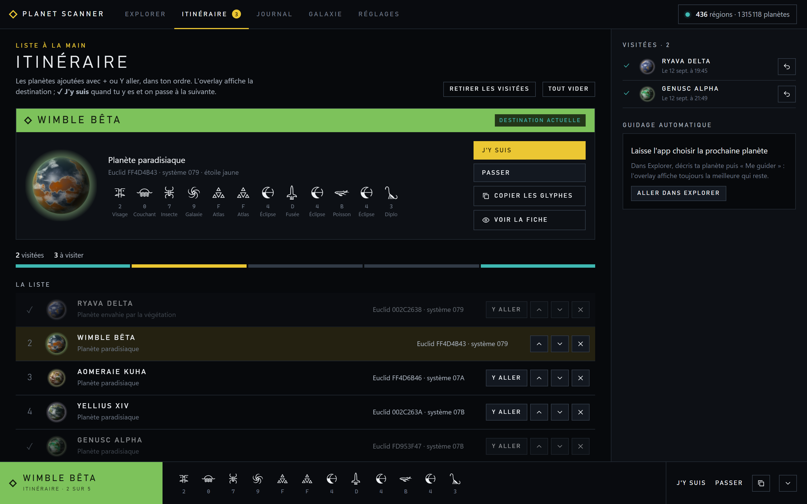
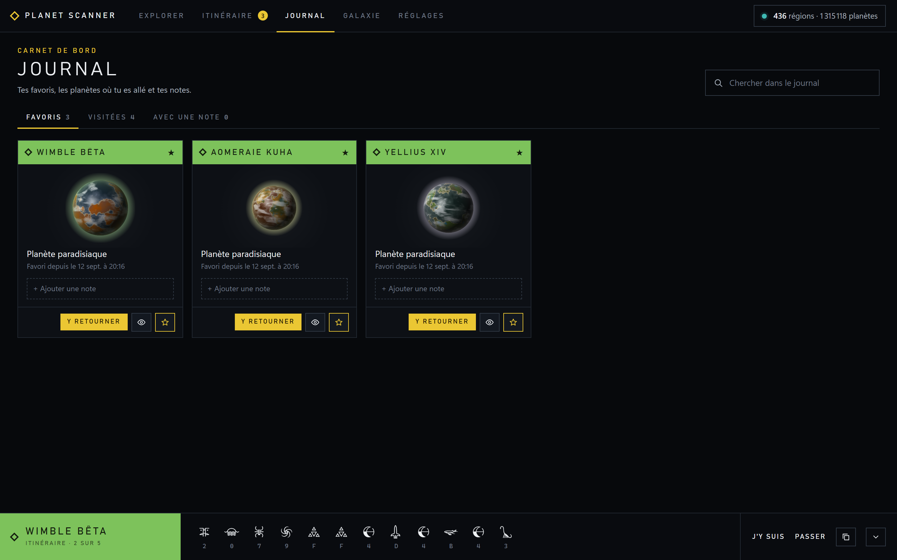
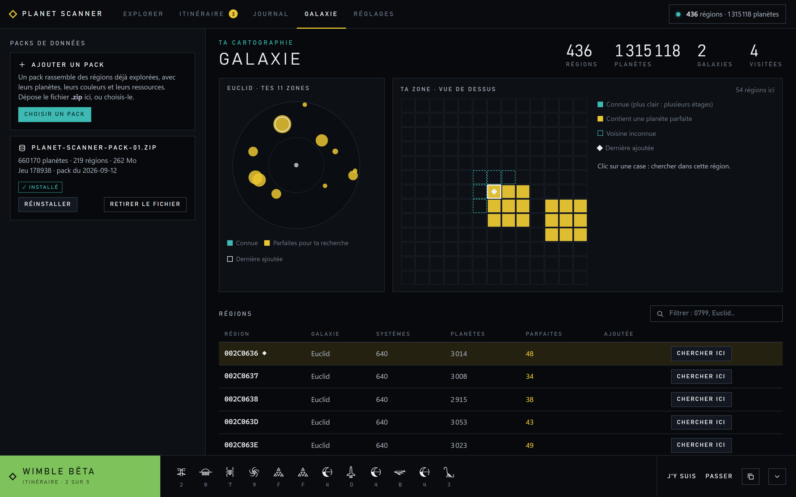

# Planet Scanner

Trouve ta planète parfaite dans No Man's Sky, sans la chercher à l'aveugle.

Planet Scanner lit des **packs de données** : des régions entières déjà explorées, avec pour chaque planète son
biome, ses couleurs, ses sentinelles, ses tempêtes, sa faune, sa flore et ses ressources. Tu décris la planète que
tu veux — « eau bleue, calme, avec du cuivre » — et l'app te donne **l'adresse du portail** des meilleures, puis
t'y guide une par une.

Tout reste sur ton PC : aucune connexion sortante, et ta sauvegarde n'est jamais touchée.

<!-- captures -->

<!-- /captures -->

## Installation

1. Décompresse l'archive où tu veux (par exemple dans `Documents`).
2. Double-clique sur **Planet Scanner.exe**. Rien à installer : ni Python, ni dépendance.
3. Télécharge un pack de données, dépose-le dans **Galaxie → Ajouter un pack**, puis clique sur **Installer**.

Un pack de 260 Mo s'installe en une minute et demie environ, et tu peux déjà chercher pendant ce temps.
L'app garde tout dans son propre dossier `data` : pour la désinstaller, supprime le dossier.

Windows 10 ou 11. L'app affiche sa fenêtre avec **WebView2**, présent d'origine sur Windows 11 et installé
avec Edge sur Windows 10 ; si la fenêtre reste vide, installe le « WebView2 Runtime » de Microsoft.

## Les cinq espaces

- **Explorer** — décris ta planète, vois le résultat (parfaites, à un critère près), lance le guidage.
- **Itinéraire** — la file que suit l'overlay : la destination en grand, la suite, et « Déjà faites » avec Annuler.
- **Journal** — favoris, planètes visitées, notes.
- **Galaxie** — tes packs, la carte de tes zones, toutes tes régions.
- **Réglages** — recherche, overlay (avec aperçu), glyphes, données.

<!-- captures -->
| | |
|---|---|
|  |  |
|  |  |
<!-- /captures -->

## En jeu

L'overlay est une petite carte posée par-dessus le jeu, qui n'apparaît que lorsque No Man's Sky a le focus : le nom
de la destination, sa description et les douze glyphes de son adresse.

Tout s'y fait à la souris, quand le curseur est libre (dans un menu du jeu, ou en fenêtre) : **✓ J'y suis** pour
passer à la suivante, **★ Favori**, **Passer**, **Masquer**, **✥** pour la déplacer, **−** et **+** pour sa taille.
Les clics ne prennent jamais le focus au jeu. Il faut jouer en **plein écran fenêtré / sans bordure**.

## Les données

- Version du jeu : **178938**. Le générateur de No Man's Sky peut changer d'une mise à jour à l'autre ; des packs
  faits pour une autre version ne correspondraient plus à ce que tu verrais en jeu.
- Les **systèmes violets** ne sont pas dans les packs : le portail refuse d'y aller tant qu'ils ne sont pas
  débloqués en jeu.
- La **ressource rare** d'une planète n'est pas connue : les packs donnent la commune et la peu commune.
- Les adresses sont celles du portail, telles qu'on les tape en jeu.

## Les glyphes

Les adresses s'affichent avec les **symboles du jeu**, dans la page comme sur la carte posée par-dessus lui :
tu lis la même chose à l'écran et dans l'app. Si tu préfères, **Réglages → Glyphes** bascule sur les dessins de
Planet Scanner, qui se lisent aussi bien.

## Licences

Le **code** est sous licence MIT (fichier `LICENSE`) : sers-t'en, modifie-le, garde la mention.

Les **packs de données** sont sous **CC BY 4.0** (fichier `LICENSE-DONNEES.md`) : utilise-les comme tu veux, cite
la source. La licence voyage avec les données : elle est écrite dans le manifeste de chaque pack.

## Crédits

La police des glyphes (*NMS Glyphs*) est © Hello Games & Stephan van der Feest ; elle accompagne l'app pour que
les adresses se lisent comme en jeu, et reste la propriété de ses auteurs.

No Man's Sky est une marque de Hello Games. Ce projet n'est pas affilié à Hello Games et n'est pas soutenu par eux.
